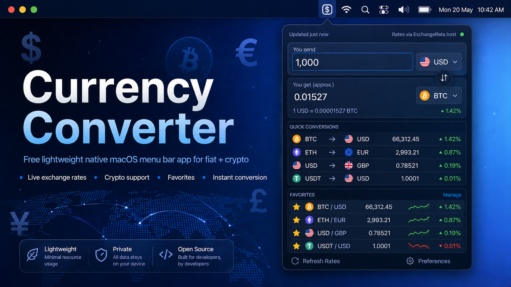

# Currency Converter for macOS

<p align="center">
  
</p>

A lightweight, native macOS menu bar app that makes live currency conversion effortless.

## What It Does

- **Live Exchange Rates**: Uses the free exchange-rate API (`fawazahmed0/exchange-api`) for over 200 world currencies.
- **Menu Bar Integration**: Quick access to live conversions from anywhere without breaking your workflow.
- **Offline Resilience**: Caches recent successful quotes and gracefully falls back to stale data when offline or experiencing API issues.
- **Favorite Pairs**: Save your most frequently used currency pairs for quick, one-click access.
- **Instant Conversions**: Converted amounts are re-calculated locally instantly as you type.

## Preview

<p align="center">
  
</p>

## Distribution

This project is not distributed through the Mac App Store. Apple's publishing process
adds more overhead than this small utility needs, so the supported path is to build
the app locally from source.

The simplest install path uses Swift Package Manager:

```bash
bash scripts/build_spm.sh
```

The script creates a normal `.app` bundle at `build/CurrencyConverter.app` and links
it into `/Applications`.

## Installation

### Requirements

- **macOS 14.0** or later
- **Xcode Command Line Tools** (minimum for building from source)
- **Xcode 15.0** or later (optional — only needed for the Xcode build path)

### Quick Install

You only need the **Command Line Tools** — no full Xcode IDE:

```bash
# 1. Install Command Line Tools (if you haven't already)
xcode-select --install

# 2. Clone and build
git clone https://github.com/0franco/currency-converter-macos.git
cd currency-converter-macos
bash scripts/build_spm.sh
```

This builds the app via Swift Package Manager, assembles a proper `.app` bundle in
`build/CurrencyConverter.app`, and symlinks it into `/Applications`.

To install somewhere else:

```bash
APP_INSTALL_DIR="$HOME/Applications" bash scripts/build_spm.sh
```

### Launching the App

Currency Converter is a menu bar app, so it does not appear in the Dock. After
launching it, look for the app icon in the top-right macOS menu bar.

```bash
open build/CurrencyConverter.app
```

## Development

The repository contains the AppKit/SwiftUI application target, shared Swift logic in
`Sources/CurrencyConverterMacOS/`, and unit tests in `Tests/CurrencyConverterMacOSTests/`.

### Run from Xcode

1. Double-click `CurrencyConverter.xcodeproj` to open the project in Xcode.
2. Wait for the project indexer to finish.
3. Ensure the active scheme is set to **CurrencyConverter** and your Mac is selected as the run destination.
4. Press `Cmd + R` or select **Product > Run**.

### Build with Swift Package Manager

This is the recommended non-Xcode build path:

```bash
bash scripts/build_spm.sh
```

The script uses `swift build` under the hood, assembles the `.app` bundle in `build/`,
and links it into `/Applications`.

Useful overrides:

```bash
CONFIGURATION=debug bash scripts/build_spm.sh
APP_INSTALL_DIR="$HOME/Applications" bash scripts/build_spm.sh
```

### Build with xcodebuild

Requires the full Xcode IDE:

```bash
bash scripts/build_and_link.sh
```

If you want the link somewhere else:

```bash
APP_INSTALL_DIR="$HOME/Applications" bash scripts/build_and_link.sh
```

### Archive with Xcode

If you have the full Xcode IDE installed:

1. Clone or download this repository.
2. Open `CurrencyConverter.xcodeproj` in Xcode.
3. From the top menu bar, select **Product > Archive**.
4. In the Organizer window, select your archive and click **Distribute App**.
5. Select **Custom**, then **Copy App**, and save the exported `CurrencyConverter.app`.
6. Move it into `/Applications`.

## Testing

To run the test suite from the terminal:

```bash
swift test
```

## Troubleshooting

**`xcodebuild` fails with "requires Xcode" error:**
You only have Command Line Tools installed. Either install full Xcode from the App Store, or use the SPM build script (`bash scripts/build_spm.sh`) which doesn't need Xcode.

If you do have Xcode installed, point the developer tools to it:
```bash
sudo xcode-select -s /Applications/Xcode.app/Contents/Developer
```
